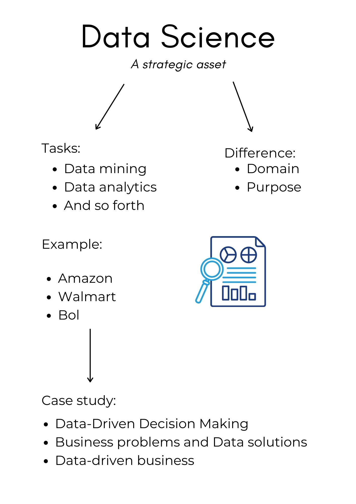

## Introduction

```{r pressure, echo=FALSE, out.width = '45%'}

```


## Business Case 1: Data Driven Decision Making

```{r }

```


## Business Case 2: Data Problems VS Data Solutions
```{r }

```


## Business Case 3: Data Driven Business
```{r}

```


## Conclusion
### Gain a competitive advantage by improving decision making
#### Main Findings:
- Small companies
- Data strategy
- Business translators
- Customer experience


## References

Andersson, R. (2016, November 23). 4 characteristics of data-driven organizations-and how to get started. Retrieved February 28, 2021, from https://www.ibm.com/blogs/think/se-sv/2016/04/15/4-characteristics-of-data-driven-organizations-and-how-to-get-started/#:%7E:text=Behind%20their%20success%20there%20are,access%20is%20integrated%20into%20tools.

Bernard Mar. (2019, May 21). Big Data and AI in Small Business [Video file]. Retrieved from https://www.youtube.com/watch?v=hYoRMqkN_TI

Bernard Mar. (2020, April 24). How To Become A More Data-Driven Company: Insights From Shell [Video file]. Retrieved from https://www.youtube.com/watch?v=QlqI0gGOjo4

Bernard Mar. (2019, July 24). How Does Netflix Use Artificial Intelligence (AI) and Big Data. [Video file]. Retrieved from https://www.youtube.com/watch?v=8M5n3uhWKHE 

Bernard Mar. (2019, May 10). The Amazing Examples Of How Caterpillar Uses Data And Analytics To Save Millions Of Dollars. [Video file].Retrieved from https://www.youtube.com/watch?v=EN77cq53Dfw 

Blumberg, S., Bossert, O., & Laartz, J. (2020, February 13). Deploying a two-speed architecture at scale. McKinsey & Company. Retrieved 25/03/2-21 from https://www.mckinsey.com/business-functions/mckinsey-digital/our-insights/deploying-a-two-speed-architecture-at-scale

Caterpillar. (2021). About Caterpillar. Retrieved from https://www.caterpillar.com/en/company.html 

How to Create a Data-Driven Culture. (2020, September 2). Retrieved March 25, 2021, from https://aws.amazon.com/vi/blogs/enterprise-strategy/how-to-create-a-data-driven-culture/

Jolly, D. (2017, September 28). What Amazon can teach us about digital transformation in manufacturing. Retrieved March 25, 2021, from https://www.nukon.com/blog/what-amazon-can-teach-us-about-digital-transformation-in-manufacturing

Pedamkar, P. (2021, March 1). Data Science vs Data Mining. EDUCBA. https://www.educba.com/data-science-vs-data-mining/

Provost, F., & Fawcett, T. (2013). Data Science for Business (2nd ed., Vol. 2019). Van Duuren Media.

Miles, J. R. (2020, March 18). Data-Driven Company —What Does It Mean to Be One? Retrieved March 25, 2021, from https://www.boldbusiness.com/digital/data-driven-company-data-driven-business-models/

Netflix ux case study | Netflix data analytics case study - Disruptive innovation. (2020, May 21). [Video]. YouTube. https://www.youtube.com/watch?v=6GZzrugo8rY&ab_channel=5MinutesLearning

Shell Global. (2021). About Us. Retrieved from https://www.shell.com/about-us.html

SQL Data Ninja, 2020, Retrieved 09/03/2021 from: "https://www.youtube.com/embed/SEXLD02Fw6U"

Team, D. (2019, May 4). Data Science at Netflix – A Must Read Case Study for Aspiring Data Scientists. Retrieved March 29, 2021, from https://data-flair.training/blogs/data-science-at-netflix/

Techopedia. (2016, May 24). Data Driven. Retrieved March 25, 2021, from https://www.techopedia.com/definition/18687/data-driven?utm_content=resources.base.vn/management/de-tro-thanh-doanh-nghiep-data-driven-651

4 Characteristics of a Data-Driven Culture. (2020, October 30). Retrieved February 28, 2021, from https://blog.ad-juster.com/4-characteristics-of-a-data-driven-culture/

10 Steps to Creating a Data-Driven Culture. (2020, February 6). Retrieved March 25, 2021, from https://hbr.org/2020/02/10-steps-to-creating-a-data-driven-culture

